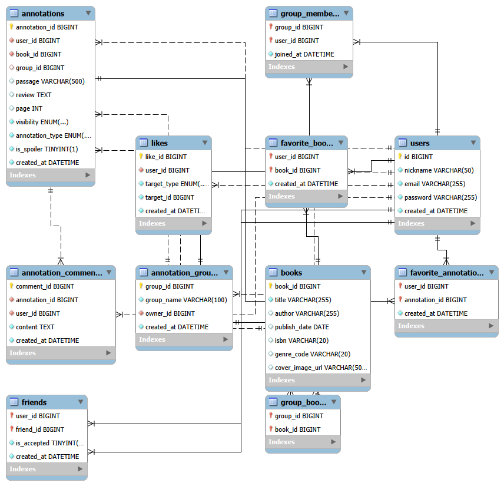

# 26s-w1-c3-02

## 공통과제 I : 웹 기반 프로젝트 (2인 1팀)

**목적:** 공통 과제를 함께 수행하며 웹 개발의 전체 흐름을 빠르게 익히고 협업에 적응하기

**결과물:** 기획부터 배포까지 완료된 웹 서비스와 관련 문서 일체

---

## 팀원

| 이름 | GitHub | 역할 |
|---|---|---|
| 이지오 | [@easy0131](https://github.com/easy0131) |  |
| 박수현 | [@suh1088](https://github.com/suh1088) |  |

---

## 기획안

> 프로젝트 주제, 목적, 핵심 기능, 예상 사용자, 팀원별 역할 등 정리

- **주제:** 책에 주석을 달 수 있는 웹 서비스 (가제: *주석노트*)

- **목적:**
  - 혼자 읽고 끝나던 독서 경험을, 책의 특정 구절에 **질문·토론·감상·일반** 유형의 카드를 남기며 생각을 기록하고 나눌 수 있는 경험으로 확장한다.
  - 저작권 문제를 피하면서도 "책 속 특정 위치"에 메모를 고정할 수 있도록, 사용자가 직접 입력한 페이지·구절을 기준으로 주석을 관리한다.
  - 공개/비공개 설정을 통해 개인 독서 노트와 공유형 독서 토론을 하나의 서비스에서 모두 지원한다.
  - 주석을 **남기는 사용자**와 특정 구절의 해설·해석을 **찾아보는 사용자**를 연결하여, 한 권의 책을 매개로 한 집단 지성 독서를 지원한다.

- **핵심 기능:**
  - **책 선정:** 홈 화면에서 주석을 달 책을 선택하거나 새로 등록 (제목·저자 등 기본 정보 입력)
  - **주석 카드 작성:** 선택한 책에 대해 **질문 / 토론 / 감상 / 일반** 유형의 카드를 생성
    - 저작권 보호를 위해 책 본문은 제공하지 않으며, 사용자가 **페이지 번호와 인용 구절을 직접 입력**해 카드에 연결
    - 카테고리별 댓글 타입 구분
  - **공개/비공개/친구공개 설정:** 카드별로 공개 여부를 지정 — 비공개는 본인만, 공개는 다른 사용자도 열람 가능, 친구공개는 친구만 열람 가능
  - **카드 열람·관리:** 책 단위로 주석 카드를 모아 보고, 유형별로 확인·수정·삭제
  - **주석 검색:** 책의 **페이지 번호 또는 구절(키워드)로 공개 주석 카드를 검색** — 이해가 안 되는 부분에 대해 다른 사용자가 남긴 질문·토론·감상·일반 카드를 바로 찾아볼 수 있음 (검색 범위: 우선 선택한 책 내부, 페이지 번호 + 인용 구절·주석 본문 키워드 대상)
  - **그룹 주석방:** 친구 추가가 되어 있는 사용자끼리 책 하나를 선택해 주석방을 새로 만들고, 각자 구절 카드와 주석을 올리며 같은 책에 대해 토론

- **예상 사용자:**
  - 읽은 책의 인상 깊은 구절과 생각을 구조적으로 기록하고 싶은 개인 독자
  - 같은 책을 읽으며 질문과 해석을 나누고 싶은 독서 모임·스터디 참여자
  - 특정 구절에 대한 토론을 남기고 공유하고 싶은 학생·연구자
  - 책을 읽다가 이해가 안 되는 부분이 있을 때, 해당 페이지·구절의 공개 주석을 검색해 도움을 얻으려는 독자 (주석을 소비하는 사용자)

- **팀원별 역할:** (팀 구성 확정 후 아래 표 및 각 섹션과 함께 작성)
  - 이지오:...
  - 박수현: ...

---

## 기능 명세서

> 구현할 기능을 사용자 관점에서 정리하고, 필수 기능과 선택 기능을 구분

### 필수 기능

1. **회원 관리 기능**
   사용자는 회원가입 및 로그인을 통해 개인 계정을 생성하고 사용할 수 있다. 로그인한 사용자는 자신의 즐겨찾기 목록, 작성한 주석 카드 등을 개인 계정에 저장할 수 있다.

2. **책 목록 검색**
   사용자는 홈 화면에서 책 목록을 확인할 수 있다. 각 책은 제목, 저자, 표지 이미지 등의 기본 정보와 함께 표시된다. 사용자는 검색창을 통해 원하는 책을 제목 또는 저자명으로 검색할 수 있다. 관심 있는 책은 즐겨찾기로 등록할 수 있으며, 이후 마이페이지나 즐겨찾기 목록에서 다시 확인할 수 있다.

3. **주석 카드 작성 기능**
   사용자는 특정 책을 선택한 뒤, 인상 깊거나 다른 사람과 이야기하고 싶은 짧은 구절을 등록할 수 있다. 주석 카드에는 책 제목, 저자, 페이지 또는 챕터 정보, 인용 구절, 사용자의 주석 내용이 포함된다. 저작권 문제를 고려하여 책 전체 내용이 아닌 짧은 구절만 등록할 수 있도록 입력 길이를 제한한다. 작성된 주석 카드는 공개 여부에 따라 다른 사용자에게 공유되거나 개인 기록으로 저장된다.

4. **댓글 기능**
<<<<<<< HEAD
   사용자는 다른 사용자가 공개한 주석 카드를 확인하고, 해당 구절에 대한 자신의 해석, 감상, 질문, 일반 등을 새로운 주석 카드로 남길 수 있다. 이를 통해 같은 구절에 대해 여러 사용자의 다양한 해석을 비교하고 독서 경험을 교환할 수 있다.
=======
   사용자는 다른 사용자가 공개한 주석 카드를 확인하고, 해당 구절에 대한 자신의 의견을 새로운 댓글로 남길 수 있다. 이를 통해 같은 구절에 대해 여러 사용자의 다양한 해석을 비교하고 독서 경험을 교환할 수 있다.
>>>>>>> d3d28b3c5ad42f0344cbf8d7f2de6229544fa697

5. **주석 탐색 기능**
   사용자는 홈 화면에서 책 목록과 표지를 확인할 수 있다. 원하는 책을 선택하면 해당 책에 등록된 여러 주석 카드를 피드 형태로 둘러볼 수 있다. 사용자는 주석 카드 목록에서 관심 있는 구절을 선택하여 상세 내용을 확인할 수 있으며, 해당 구절에 자신의 감상이나 해석을 새로운 주석 카드로 남길 수 있다.

6. **마이페이지 기능**
   사용자는 자신이 작성한 주석 카드, 즐겨찾기한 책, 참여 중인 그룹 주석방을 한 곳에서 확인할 수 있다.

7. **친구 추가 기능**
   사용자는 닉네임으로 다른 사용자를 검색하여 친구로 추가할 수 있다. 서로 친구 추가가 되면, 마이페이지의 친구 목록에서 확인할 수 있으며 해당 친구와 함께 그룹 주석방을 생성하거나 초대할 수 있다.

### 선택 기능

1. **즐겨찾기 기능**
   사용자는 마음에 드는 주석 카드를 즐겨찾기에 추가할 수 있다. 즐겨찾기한 주석 카드는 마이페이지에서 다시 확인할 수 있으며, 사용자는 이를 통해 인상 깊었던 문장과 해석을 따로 모아볼 수 있다.

2. **스포일러 표시 기능**
   사용자는 주석 카드를 작성할 때 스포일러 포함 여부를 선택할 수 있다. 스포일러로 표시된 주석 카드는 기본적으로 내용이 가려진 상태로 표시되며, 사용자가 직접 확인 버튼을 눌렀을 때만 내용을 볼 수 있다. 이를 통해 아직 해당 책을 읽지 않은 사용자도 결말이나 중요한 전개를 미리 알게 되는 것을 방지할 수 있다.

3. **그룹 주석방 기능**
   사용자는 다른 사용자들과 특정 책을 중심으로 그룹 주석방을 새로 만들 수 있다. 그룹 주석방 안에서는 참여자들이 각자 주석 카드를 공유할 수 있다. 참여자는 다른 사람이 공유한 주석 카드에 새로운 주석 카드를 남기며 같은 책에 대한 다양한 해석과 감상을 나눌 수 있다. 이를 통해 친구, 독서 모임, 수업 팀 단위로 하나의 책을 함께 읽고 토론하는 공간을 제공한다.

4. **좋아요 기능**
   사용자는 다른 사용자가 작성한 주석 카드에 좋아요를 남길 수 있다. 각 주석 카드에는 좋아요 수가 표시되며, 사용자는 이를 통해 많은 공감을 받은 구절과 해석을 빠르게 확인할 수 있다. 즐겨찾기가 개인적으로 모아보기 위한 기능이라면, 좋아요는 다른 사용자와의 공감·반응을 가볍게 표현하는 기능이다.

---

## IA 및 화면 설계서

> 서비스의 전체 페이지 구조와 페이지 간 이동 흐름; 각 페이지의 주요 UI 구성, 입력 요소, 버튼, 사용자 행동 흐름 등을 간단한 와이어프레임 형태로 정리

### IA 구조도


### 화면 예시

| 로그인 | 홈 (책 목록) |
|---|---|
|  |  |

| 책 상세 (주석 카드 목록) | 주석 카드 상세 (질문·토론·감상·일반) |
|---|---|
|  |  |


---

## DB 스키마

> 필요한 테이블, 주요 필드, 데이터 타입, 테이블 간 관계를 정리
<!-- ERD 이미지 또는 테이블 정의 -->


---

## API 문서

> API 주소, 요청 방식, 요청값, 응답값, 에러 상황을 정리
> 상세 스펙(공통 규약·ENUM·객체 스키마 등)은 [api-spec.md](api-spec.md) 참고

**Base URL:** `/api`  ·  **인증:** JWT Bearer (`Authorization: Bearer <accessToken>`, 🔒 표시된 항목만 필요)
**공통 에러 포맷:** `{ "error": { "code": "...", "message": "..." } }` — `400 VALIDATION_ERROR` · `401 UNAUTHORIZED` · `403 FORBIDDEN` · `404 NOT_FOUND` · `409 DUPLICATE` · `500 INTERNAL_ERROR`

### 인증 · 사용자

| Method | Endpoint | 설명 | 요청 | 응답 |
|---|---|---|---|---|
| POST | `/api/auth/register` | 회원가입 | Body: `{ nickname, email, password }` | `201` `{ id, nickname, email, createdAt }`<br>`400` 형식 오류 · `409` 이메일/닉네임 중복 |
| POST | `/api/auth/login` | 로그인(토큰 발급) | Body: `{ email, password }` | `200` `{ accessToken, user }`<br>`401` 이메일/비밀번호 불일치 |
| POST | `/api/auth/logout` 🔒 | 로그아웃 | - | `204` |
| GET | `/api/users/me` 🔒 | 내 정보 조회 | - | `200` `{ id, nickname, email, createdAt }` |
| PATCH | `/api/users/me` 🔒 | 닉네임/비밀번호 변경 | Body: `{ nickname?, password? }` | `200` 수정된 사용자 객체<br>`409` 닉네임 중복 |
| GET | `/api/users` 🔒 | 닉네임으로 사용자 검색(친구 추가용) | Query: `nickname` | `200` `{ data: [{ id, nickname }] }` |

### 도서

| Method | Endpoint | 설명 | 요청 | 응답 |
|---|---|---|---|---|
| GET | `/api/books` | 책 목록 조회 · 검색(제목/저자) | Query: `keyword, genreCode, page, size` | `200` `{ data: [책 객체], pagination }` |
| GET | `/api/books/{bookId}` | 책 상세 | - | `200` 책 객체 + `annotationCount, isFavorited`<br>`404` 책 없음 |
| POST | `/api/books` 🔒 | 새 책 등록 | Body: `{ title, author, publishDate, isbn, genreCode, coverImageUrl }` | `201` 생성된 책 객체<br>`409` 동일 ISBN 존재 |

### 즐겨찾기 — 책

| Method | Endpoint | 설명 | 요청 | 응답 |
|---|---|---|---|---|
| POST | `/api/books/{bookId}/favorite` 🔒 | 책 즐겨찾기 추가 | - | `201`<br>`409` 이미 즐겨찾기 상태 |
| DELETE | `/api/books/{bookId}/favorite` 🔒 | 즐겨찾기 해제 | - | `204` |
| GET | `/api/users/me/favorite-books` 🔒 | 내 즐겨찾기 책 목록 | - | `200` 책 객체 배열(페이지네이션) |

### 주석 카드

| Method | Endpoint | 설명 | 요청 | 응답 |
|---|---|---|---|---|
| POST | `/api/annotations` 🔒 | 주석 카드 작성 | Body: `{ bookId, type?, passage, review, page, visibility, isSpoiler, groupId? }` | `201` 주석 카드 객체<br>`404` 책/그룹 없음 · `403` 그룹 멤버 아님 |
| GET | `/api/books/{bookId}/annotations` | 특정 책의 주석 카드 피드 | Query: `type, sort, page, size` | `200` 주석 카드 객체 배열(페이지네이션) |
| GET | `/api/annotations/{annotationId}` | 주석 카드 상세 | - | `200` 주석 카드 객체<br>`404` 없음 · `403` 접근 권한 없음 |
| PATCH | `/api/annotations/{annotationId}` 🔒 | 주석 카드 수정(작성자) | Body: `{ review?, visibility?, isSpoiler?, type? }` | `200` 수정된 주석 카드 객체<br>`403` 작성자 아님 · `404` 없음 |
| DELETE | `/api/annotations/{annotationId}` 🔒 | 주석 카드 삭제(작성자) | - | `204`<br>`403` 작성자 아님 · `404` 없음 |
| GET | `/api/annotations/search` | 페이지·키워드로 공개 주석 검색 | Query: `bookId, keyword, pageNumber, type, sort, page, size` | `200` 주석 카드 객체 배열(페이지네이션) |
| GET | `/api/users/me/annotations` 🔒 | 내가 작성한 주석 목록(마이페이지) | - | `200` 주석 카드 객체 배열(페이지네이션) |

### 댓글

| Method | Endpoint | 설명 | 요청 | 응답 |
|---|---|---|---|---|
| POST | `/api/annotations/{annotationId}/comments` 🔒 | 댓글 작성 | Body: `{ content }` | `201` 댓글 객체<br>`404` 원글 없음 |
| GET | `/api/annotations/{annotationId}/comments` | 댓글 목록 | - | `200` 댓글 객체 배열(페이지네이션) |
| PATCH | `/api/comments/{commentId}` 🔒 | 댓글 수정(작성자) | Body: `{ content }` | `200` 수정된 댓글 객체<br>`403`/`404` |
| DELETE | `/api/comments/{commentId}` 🔒 | 댓글 삭제(작성자) | - | `204`<br>`403`/`404` |

### 즐겨찾기 — 주석

| Method | Endpoint | 설명 | 요청 | 응답 |
|---|---|---|---|---|
| POST | `/api/annotations/{annotationId}/favorite` 🔒 | 주석 즐겨찾기 추가 | - | `201`<br>`409` 중복 |
| DELETE | `/api/annotations/{annotationId}/favorite` 🔒 | 즐겨찾기 해제 | - | `204` |
| GET | `/api/users/me/favorite-annotations` 🔒 | 내 즐겨찾기 주석 목록 | - | `200` 주석 카드 객체 배열(페이지네이션) |

### 좋아요

| Method | Endpoint | 설명 | 요청 | 응답 |
|---|---|---|---|---|
| POST | `/api/likes` 🔒 | 좋아요 추가 | Body: `{ targetType, targetId }` | `201` `{ likeId, targetType, targetId, createdAt }`<br>`409` 중복 · `404` 대상 없음 |
| DELETE | `/api/likes` 🔒 | 좋아요 취소 | Query: `targetType, targetId` | `204`<br>`404` 좋아요 기록 없음 |

### 친구

| Method | Endpoint | 설명 | 요청 | 응답 |
|---|---|---|---|---|
| POST | `/api/friends` 🔒 | 친구 요청 보내기 | Body: `{ friendId }` | `201` `{ requesterId, addresseeId, status, createdAt }`<br>`409` 이미 요청/친구 · `404` 대상 없음 · `400` 자기 자신 |
| GET | `/api/users/me/friend-requests` 🔒 | 받은/보낸 친구 요청 목록 | Query: `direction`(received/sent) | `200` `{ data: [...] }` |
| POST | `/api/friends/{userId}/accept` 🔒 | 친구 요청 수락 | - | `200` `{ userId, nickname, status }`<br>`404` 요청 없음 · `403` 내가 받은 요청 아님 |
| DELETE | `/api/friends/{userId}` 🔒 | 요청 거절·취소 / 친구 삭제 | - | `204`<br>`404` 관계 없음 |
| GET | `/api/users/me/friends` 🔒 | 내 친구 목록(수락된 것만) | - | `200` `{ data: [...] }` |

### 그룹 주석방

| Method | Endpoint | 설명 | 요청 | 응답 |
|---|---|---|---|---|
| POST | `/api/groups` 🔒 | 그룹 생성(생성자=방장) | Body: `{ groupName, bookIds, memberIds }` | `201` `{ groupId, groupName, owner, createdAt }` |
| GET | `/api/users/me/groups` 🔒 | 내가 속한 그룹 목록 | - | `200` 그룹 객체 배열 |
| GET | `/api/groups/{groupId}` 🔒(멤버) | 그룹 상세(멤버·도서 포함) | - | `200` `{ groupId, groupName, owner, members, books }`<br>`403` 멤버 아님 · `404` 없음 |
| PATCH | `/api/groups/{groupId}` 🔒 | 그룹 이름 변경(방장) | Body: `{ groupName }` | `200` 수정된 그룹 객체<br>`403` 방장 아님 |
| DELETE | `/api/groups/{groupId}` 🔒 | 그룹 삭제(방장) | - | `204`<br>`403` 방장 아님 |

### 그룹 참여자

| Method | Endpoint | 설명 | 요청 | 응답 |
|---|---|---|---|---|
| POST | `/api/groups/{groupId}/members` 🔒 | 멤버 초대/추가(방장) | Body: `{ userId }` | `201`<br>`403` 방장 아님 · `409` 이미 멤버 · `404` 사용자 없음 |
| GET | `/api/groups/{groupId}/members` 🔒(멤버) | 멤버 목록 | - | `200` 멤버 객체 배열 |
| DELETE | `/api/groups/{groupId}/members/{userId}` 🔒 | 내보내기(방장) 또는 나가기(본인) | - | `204`<br>`403` 권한 없음 |

### 그룹 도서

| Method | Endpoint | 설명 | 요청 | 응답 |
|---|---|---|---|---|
| POST | `/api/groups/{groupId}/books` 🔒(멤버) | 그룹에 도서 추가 | Body: `{ bookId }` | `201`<br>`409` 중복 |
| GET | `/api/groups/{groupId}/books` 🔒(멤버) | 그룹 도서 목록 | - | `200` 책 객체 배열 |
| DELETE | `/api/groups/{groupId}/books/{bookId}` 🔒(멤버) | 그룹 도서 제거 | - | `204` |

### 그룹 주석 피드

| Method | Endpoint | 설명 | 요청 | 응답 |
|---|---|---|---|---|
| GET | `/api/groups/{groupId}/annotations` 🔒(멤버) | 그룹 안에서 작성된 주석 모아보기 | Query: `type, sort, page, size` | `200` 주석 카드 객체 배열(페이지네이션)<br>`403` 멤버 아님 |

---

## 배포 결과물

> 접속 가능한 링크, 실행 방법, 주요 구현 내용

- **서비스 URL:**
- **실행 방법:**

```bash
# 실행 방법 작성
```

---

## 회고 문서

> 개발 과정에서의 어려움, 해결 방법, 역할 분담, 다음에 개선할 점 (KPT 방법론 참고)

### Keep

### Problem

### Try

---

## 참고 자료

- [SDD(스펙 주도 개발) 이해하기](https://news.hada.io/topic?id=21338)
- [Software Design Document Best Practices](https://www.atlassian.com/work-management/project-management/design-document)
- [IA 정보구조도 작성 방법](https://brunch.co.kr/@nyonyo/7)
- [기획자 화면설계서 작성법](https://brunch.co.kr/@soup/10)
- [Figma 와이어프레임 가이드](https://www.figma.com/ko-kr/resource-library/what-is-wireframing/)
- [무료 Figma 와이어프레임 키트](https://www.figma.com/ko-kr/templates/wireframe-kits/)
- [ERD/DB 설계 총정리](https://inpa.tistory.com/entry/DB-%F0%9F%93%9A-%EB%8D%B0%EC%9D%B4%ED%84%B0-%EB%AA%A8%EB%8D%B8%EB%A7%81-%EA%B0%9C%EB%85%90-ERD-%EB%8B%A4%EC%9D%B4%EC%96%B4%EA%B7%B8%EB%9E%A8)
- [API 명세서 작성 가이드라인](https://velog.io/@sebinChu/BackEnd-API-%EB%AA%85%EC%84%B8%EC%84%9C-%EC%9E%91%EC%84%B1-%EA%B0%80%EC%9D%B4%EB%93%9C-%EB%9D%BC%EC%9D%B8)
- [좋은 README 작성하는 방법](https://velog.io/@sabo/good-readme)
- [단기 프로젝트 회고 KPT 방법론](https://velog.io/@habwa/%EB%8B%A8%EA%B8%B0-%ED%94%84%EB%A1%9C%EC%A0%9D%ED%8A%B8-%ED%9A%8C%EA%B3%A0-KPT-%EB%B0%A9%EB%B2%95%EB%A1%A0)
