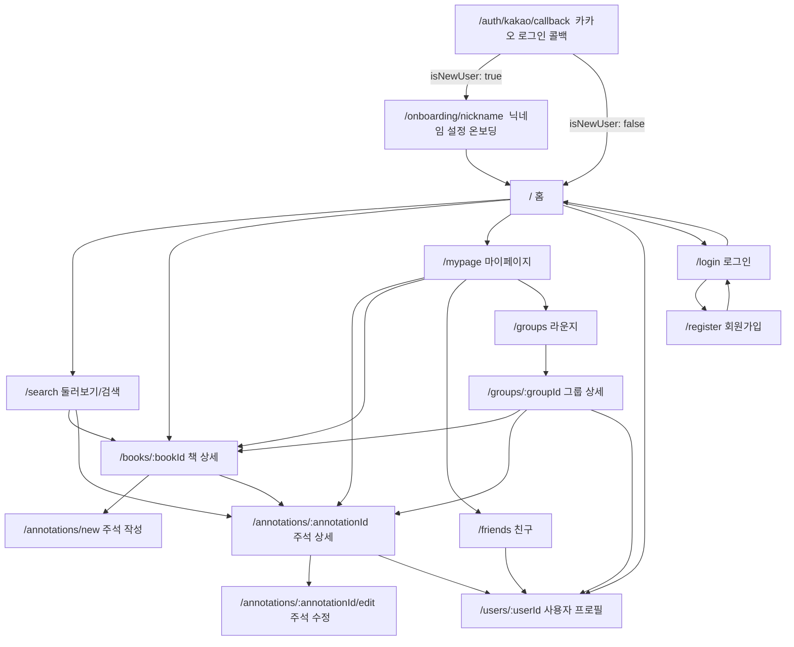
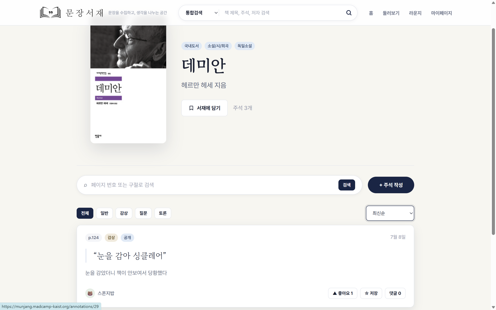
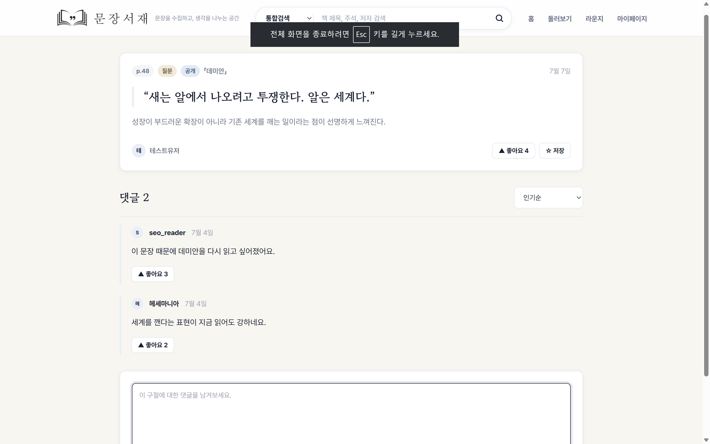
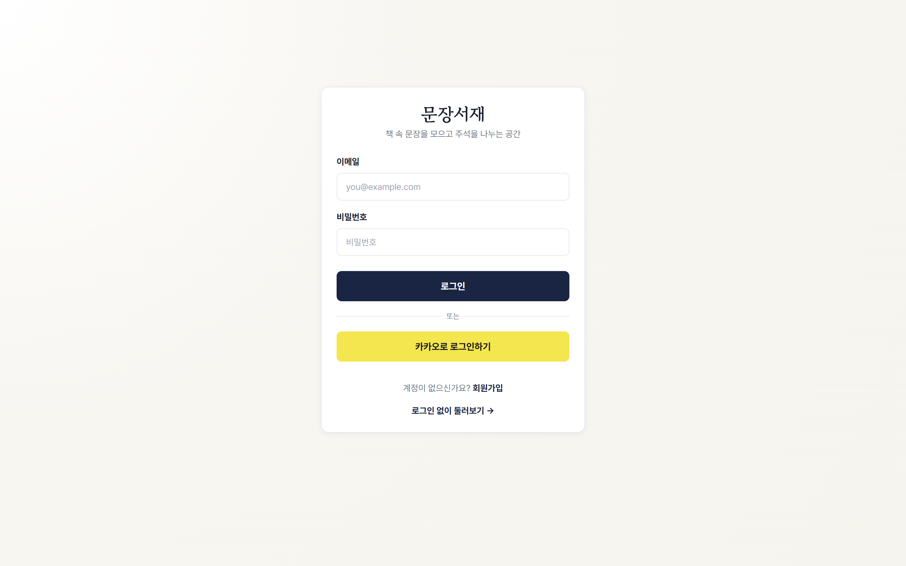
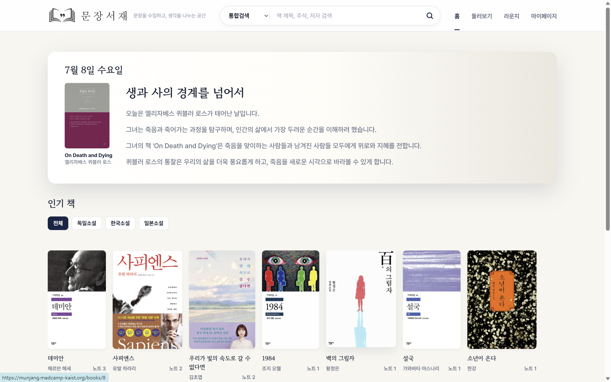
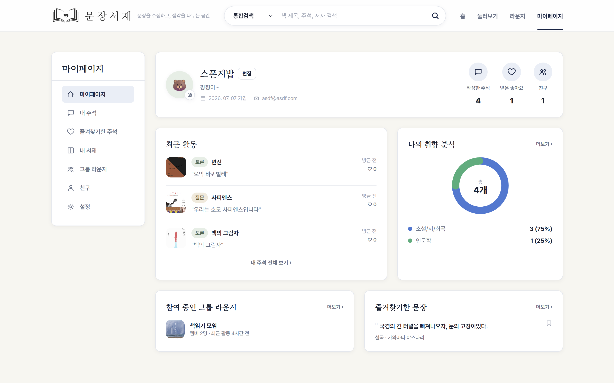
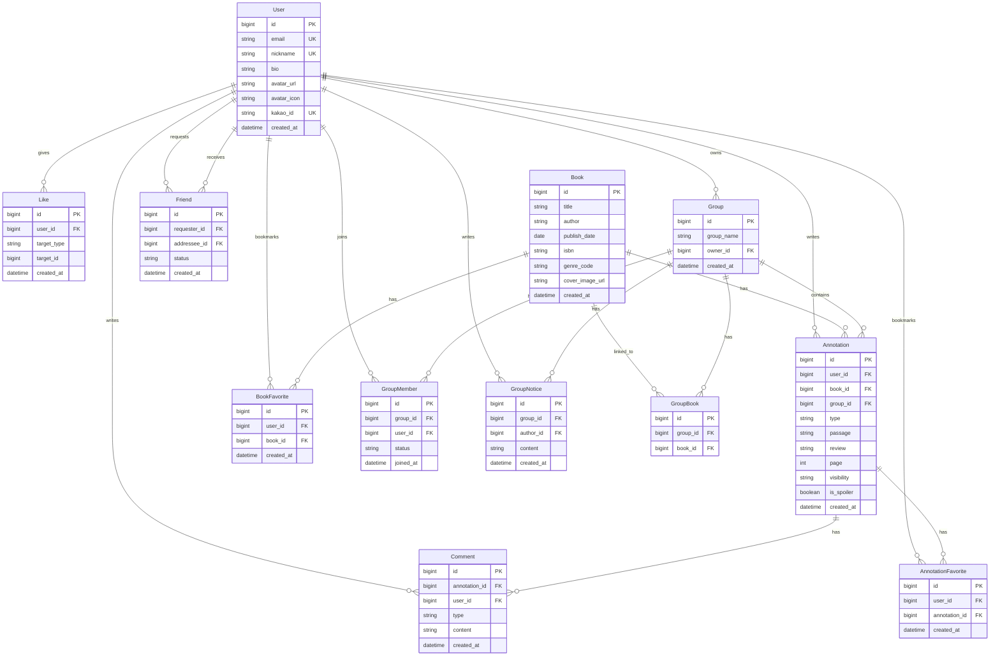

# 문장서재

책 속 문장을 직접 기록하고, 같은 구절에 대한 질문·토론·감상을 나누는 웹 기반 독서 주석 서비스입니다.

## 프로젝트 개요

문장서재는 책 전문을 제공하지 않고, 사용자가 직접 입력한 짧은 인용 구절과 페이지 번호를 기준으로 주석 카드를 쌓아가는 서비스입니다. 개인 독서 노트처럼 비공개로 기록할 수도 있고, 공개·친구 공개·그룹 공개 범위를 선택해 다른 독자와 생각을 나눌 수도 있습니다.

## 팀원

| 이름 | GitHub | 담당 |
|---|---|---|
| 이지오 | [@easy0131](https://github.com/easy0131) | 도서·주석·검색·좋아요·즐겨찾기 |
| 박수현 | [@suh1088](https://github.com/suh1088) | 인증·마이페이지·친구·그룹 주석방 |

## 핵심 기능

### 인증 및 사용자

- 이메일/비밀번호 기반 회원가입 및 로그인
- 카카오 소셜 로그인 (최초 로그인 시 닉네임 설정 온보딩 포함)
- JWT Bearer 토큰 기반 API 인증
- 로그인 없이도 홈/검색/책·주석 열람 가능, 작성·참여·마이페이지는 로그인 필요
- 마이페이지에서 내 정보, 작성한 주석, 즐겨찾기한 책/주석, 친구, 그룹 확인
- 닉네임 기반 사용자 검색 및 친구 요청/수락/삭제

### 책 탐색 및 북마크

- 홈 화면에서 책 목록과 장르 필터 제공
- 검색 화면에서 책 제목/저자/주석 통합 검색
- 알라딘 API 연동으로 새로운 책 검색 및 등록
- 책 상세 화면에서 주석 피드, 페이지/키워드 검색, 정렬 제공
- 책 북마크 추가/해제
- 북마크한 책은 마이페이지 내 서재에서 확인 및 해제 가능

### 주석 카드

- 책별로 구절 노트 작성
- 주석 유형: `QUESTION`, `DISCUSSION`, `REVIEW`, `NORMAL`
- 입력 항목: 책, 페이지, 인용 구절, 주석 내용, 공개 범위, 스포일러 여부, 그룹 여부
- 주석 상세에서 댓글 작성, 댓글 유형 필터, 좋아요, 수정/삭제 지원
- 스포일러 주석은 기본적으로 가려서 표시하고 사용자가 직접 열람

### 주석 즐겨찾기와 좋아요

- 주석 즐겨찾기 추가/해제
- 홈 피드, 검색 결과, 책 상세 주석 카드, 주석 상세에서 바로 저장 가능
- 즐겨찾기한 주석은 마이페이지에서 다시 확인
- 주석과 댓글 좋아요 추가/취소

### 그룹 주석방

- 라운지(그룹 목록) 및 마이페이지에서 그룹 생성
- 그룹 상세에서 그룹 이름 수정, 그룹 삭제/나가기
- 멤버 초대 → 상대방 수락/거절 흐름, 멤버 내보내기
- 받은 초대는 라운지와 마이페이지에서 확인 및 수락/거절
- 그룹 도서 추가/제거
- 그룹 도서를 클릭하면 그룹원 주석만 모아 보는 책 상세로 이동
- 그룹 주석 피드는 `groupId`, `bookId`, `type` 기반 필터를 지원

## 화면 구조

| 경로 | 화면 | 주요 기능 |
|---|---|---|
| `/` | 홈 | 책 목록, 장르 필터, 오늘의 문장피드, 책 북마크, 주석 저장 |
| `/search` | 둘러보기/검색 | 책 검색, 주석 검색, 인기 책, 인기 구절노트, 북마크/저장 |
| `/books/:bookId` | 책 상세 | 책 정보, 책 북마크, 주석 목록, 주석 검색, 주석 저장/좋아요 |
| `/annotations/new` | 주석 작성 | 책/구절/페이지/유형/공개범위/스포일러 입력 |
| `/annotations/:annotationId` | 주석 상세 | 주석 본문, 좋아요, 저장, 댓글 작성/삭제 |
| `/annotations/:annotationId/edit` | 주석 수정 | 기존 주석 편집 |
| `/login` | 로그인 | 로그인 및 토큰 저장 |
| `/register` | 회원가입 | 계정 생성 |
| `/auth/kakao/callback` | 카카오 로그인 콜백 | 카카오 인가 코드 처리 및 토큰 저장 |
| `/onboarding/nickname` | 닉네임 설정 온보딩 | 카카오 최초 로그인 시 닉네임 입력 |
| `/mypage` | 마이페이지 | 대시보드, 내 주석, 즐겨찾기, 내 서재, 그룹, 친구, 설정 |
| `/users/:userId` | 사용자 프로필 | 다른 사용자의 공개 프로필/활동 조회 |
| `/friends` | 친구 | 친구 목록/요청 관리 |
| `/groups` | 라운지 | 참여 중인 그룹 목록, 그룹 생성, 받은 초대 수락/거절 |
| `/groups/:groupId` | 그룹 상세 | 그룹 정보, 멤버 초대/관리, 도서 관리 |

## 기술 스택

| 영역 | 사용 |
|---|---|
| Frontend | Vite, React, React Router |
| HTTP Client | axios |
| Styling | Tailwind CSS + 전역 컴포넌트 클래스 |
| Auth State | React Context |
| Backend | Django, Django REST Framework |
| Database | MySQL |
| Auth | JWT Bearer (djangorestframework-simplejwt), 카카오 소셜 로그인(OAuth) |
| 배포 | Docker Compose (nginx + gunicorn + MySQL), KAIST VM |

## 폴더 구조

```text
26s-w1-c3-02/
├── docker-compose.yml       # db(MySQL) + backend(gunicorn) + frontend(nginx) 통합 실행
├── backend/
│   ├── Dockerfile
│   ├── manage.py
│   ├── requirements.txt
│   ├── config/              # 설정·루트 URL (settings, urls, wsgi)
│   ├── common/              # 공통 인프라 (pagination, exceptions, permissions)
│   ├── accounts/            # User, Friend — 인증·사용자·친구 (카카오 로그인 포함)
│   ├── groups/              # Group, GroupMember, GroupBook — 그룹 주석방
│   ├── books/               # Book, BookFavorite — 도서·북마크·알라딘 연동
│   ├── annotations/         # Annotation, Comment, Like, AnnotationFavorite
│   └── fixtures/            # seed.json (데모 데이터)
└── frontend/
    ├── Dockerfile
    ├── nginx.conf           # 정적 서빙 + /api·/admin 프록시
    ├── src/
    │   ├── api/             # axios 클라이언트 및 도메인별 API 모듈
    │   ├── components/
    │   ├── context/         # AuthContext
    │   ├── features/        # 도메인별 기능 모듈 (annotations, auth, books, friends, groups, mypage)
    │   ├── hooks/
    │   ├── lib/             # kakao.js 등 외부 연동
    │   ├── pages/           # 화면 컴포넌트 (위 화면 구조 참고)
    │   ├── utils/
    │   └── styles/
    └── package.json
```

## IA 및 화면 설계서

> 서비스의 전체 페이지 구조와 페이지 간 이동 흐름; 각 페이지의 주요 UI 구성, 입력 요소, 버튼, 사용자 행동 흐름 등을 간단한 와이어프레임 형태로 정리

### 플로우 차트



### 화면 설계서

<!-- TODO: 각 화면 캡처/와이어프레임 이미지로 교체하세요. 경로 예시: docs/media/screens/{name}.png -->

#### 홈 (`/`)


#### 둘러보기/검색 (`/search`)


#### 책 상세 (`/books/:bookId`)



#### 주석 작성 (`/annotations/new`)


#### 주석 상세 (`/annotations/:annotationId`)



#### 주석 수정 (`/annotations/:annotationId/edit`)


#### 로그인 (`/login`)



#### 회원가입 (`/register`)


#### 카카오 로그인 콜백 (`/auth/kakao/callback`)


#### 닉네임 설정 온보딩 (`/onboarding/nickname`)


#### 마이페이지 (`/mypage`)



#### 사용자 프로필 (`/users/:userId`)


#### 친구 (`/friends`)


#### 라운지 (`/groups`)


#### 그룹 상세 (`/groups/:groupId`)



## DB 스키마



> `Like`는 `target_type`(`annotation`/`comment`) + `target_id`로 대상을 가리키는 polymorphic 관계라 위 다이어그램에는 FK 화살표로 표현하지 않았습니다.

## API 문서

상세 API 명세는 [docs/api-spec.md](docs/api-spec.md)를 참고합니다. Base URL은 `/api`이며, JWT Bearer 토큰으로 인증합니다(🔒 표시된 endpoint만 인증 필요).

<details>
<summary><strong>인증/사용자</strong></summary>

| Method | Endpoint | 설명 | 요청 | 응답 |
|---|---|---|---|---|
| POST | `/api/auth/register` | 회원가입 | `{ nickname, email, password }` | `{ id, nickname, email, createdAt }` |
| GET | `/api/auth/nickname-check` | 닉네임 중복 확인 | query `nickname` | `{ available }` |
| GET | `/api/auth/email-check` | 이메일 중복 확인 | query `email` | `{ available }` |
| POST | `/api/auth/login` | 로그인 및 토큰 발급 | `{ email, password }` | `{ accessToken, user }` |
| POST | `/api/auth/kakao` | 카카오 로그인/가입 및 토큰 발급 | `{ code, redirectUri }` | `{ accessToken, user, isNewUser }` |
| POST 🔒 | `/api/auth/logout` | 로그아웃 | - | `204 No Content` |
| GET 🔒 | `/api/users/me` | 내 정보 조회 | - | `User` |
| PATCH 🔒 | `/api/users/me` | 프로필 수정 | `{ nickname?, password?, bio?, avatarUrl?, avatarIcon? }` | 수정된 `User` |
| GET 🔒 | `/api/users` | 닉네임 사용자 검색 | query `nickname` | `{ data: [{ id, nickname }] }` |
| GET | `/api/users/{userId}` | 사용자 공개 프로필 조회 | - | `{ id, nickname, bio, avatarUrl, avatarIcon, createdAt, annotationCount, totalLikes }` |

</details>

<details>
<summary><strong>책</strong></summary>

| Method | Endpoint | 설명 | 요청 | 응답 |
|---|---|---|---|---|
| GET | `/api/books` | 책 목록/검색 | query `keyword, genreCode, sort, page, size` | `{ data: [Book], pagination }` |
| GET | `/api/books/categories` | 최근 30일 좋아요 기반 인기 카테고리 상위 3개 | - | `{ data: [{ label, value, count }] }` |
| GET | `/api/books/daily-quote` | 오늘의 문장 큐레이션 | query `date?` | `{ date, topic, author, book_title, content, coverImageUrl, isbn }` |
| GET | `/api/books/external-search` | 알라딘 도서 검색(등록 전 미리보기) | query `keyword, field?, page?, size?` | `{ data: [...] }` |
| POST | `/api/books/import-from-aladin` | 알라딘 ISBN으로 책 등록/조회 | `{ isbn }` | `Book` |
| GET | `/api/books/recommendations` | 추천 책 목록 | query `size?` | `Book[]` |
| GET | `/api/books/{bookId}` | 책 상세 | - | `Book` |
| POST 🔒 | `/api/books` | 책 등록 | `{ title, author, publishDate, isbn, genreCode, coverImageUrl }` | 생성된 `Book` |
| POST 🔒 | `/api/books/{bookId}/favorite` | 책 북마크 추가 | - | `201` |
| DELETE 🔒 | `/api/books/{bookId}/favorite` | 책 북마크 해제 | - | `204` |
| GET 🔒 | `/api/users/me/favorite-books` | 내 북마크 책 목록 | - | `Book` 목록 페이지네이션 |

</details>

<details>
<summary><strong>주석</strong></summary>

| Method | Endpoint | 설명 | 요청 | 응답 |
|---|---|---|---|---|
| GET | `/api/annotations/feed` | 홈/둘러보기 주석 피드 | query `recentHours?, scope?, sort?, page, size` | `Annotation` 목록 페이지네이션 |
| GET | `/api/annotations/search` | 주석 검색 | query `bookId?, keyword?, pageNumber?, type?, sort?, page, size` | `Annotation` 목록 페이지네이션 |
| POST 🔒 | `/api/annotations` | 주석 작성 | `{ bookId, type, passage, review, page, visibility, isSpoiler, groupId }` | 생성된 `Annotation` |
| GET | `/api/annotations/{annotationId}` | 주석 상세 | - | `Annotation` |
| PATCH 🔒 | `/api/annotations/{annotationId}` | 주석 수정 | 수정할 필드 일부 | 수정된 `Annotation` |
| DELETE 🔒 | `/api/annotations/{annotationId}` | 주석 삭제 | - | `204` |
| GET | `/api/books/{bookId}/annotations` | 책별 주석 목록 | query `type?, sort?, page, size` | `Annotation` 목록 페이지네이션 |
| POST 🔒 | `/api/annotations/{annotationId}/favorite` | 주석 즐겨찾기 추가 | - | `201` |
| DELETE 🔒 | `/api/annotations/{annotationId}/favorite` | 주석 즐겨찾기 해제 | - | `204` |
| GET 🔒 | `/api/users/me/annotations` | 내가 작성한 주석 목록 | - | `Annotation` 목록 페이지네이션 |
| GET | `/api/users/{userId}/annotations` | 특정 사용자가 작성한 주석 목록(공개 범위 준수) | - | `Annotation` 목록 페이지네이션 |
| GET 🔒 | `/api/users/me/favorite-annotations` | 내 즐겨찾기 주석 목록 | - | `Annotation` 목록 페이지네이션 |

</details>

<details>
<summary><strong>댓글 · 좋아요</strong></summary>

| Method | Endpoint | 설명 | 요청 | 응답 |
|---|---|---|---|---|
| GET | `/api/annotations/{annotationId}/comments` | 댓글 목록 | query `type?, sort?, page, size` | `Comment` 목록 페이지네이션 |
| POST 🔒 | `/api/annotations/{annotationId}/comments` | 댓글 작성 | `{ type, content }` | 생성된 `Comment` |
| PATCH 🔒 | `/api/comments/{commentId}` | 댓글 수정 | `{ content }` | 수정된 `Comment` |
| DELETE 🔒 | `/api/comments/{commentId}` | 댓글 삭제 | - | `204` |
| POST 🔒 | `/api/likes` | 좋아요 추가 | `{ targetType, targetId }` | `{ likeId, targetType, targetId, createdAt }` |
| DELETE 🔒 | `/api/likes` | 좋아요 취소 | query `targetType, targetId` | `204` |

</details>

<details>
<summary><strong>친구</strong></summary>

| Method | Endpoint | 설명 | 요청 | 응답 |
|---|---|---|---|---|
| GET 🔒 | `/api/users/me/friends` | 내 친구 목록 | - | `{ data: [...] }` |
| GET 🔒 | `/api/users/me/friend-requests` | 친구 요청 목록 | query `direction: received\|sent` | `{ data: [...] }` |
| POST 🔒 | `/api/friends` | 친구 요청 보내기 | `{ friendId }` | `{ requesterId, addresseeId, status, createdAt }` |
| POST 🔒 | `/api/friends/{userId}/accept` | 친구 요청 수락 | - | `{ requesterId, addresseeId, status, createdAt }` |
| DELETE 🔒 | `/api/friends/{userId}` | 요청 취소/거절 또는 친구 삭제 | - | `204` |

</details>

<details>
<summary><strong>그룹 주석방</strong></summary>

| Method | Endpoint | 설명 | 요청 | 응답 |
|---|---|---|---|---|
| GET 🔒 | `/api/users/me/groups` | 내가 속한 그룹 목록 | - | `Group[]` |
| POST 🔒 | `/api/groups` | 그룹 생성 | `{ groupName, bookIds?, memberIds? }` | 생성된 `Group` |
| GET 🔒 | `/api/groups/{groupId}` | 그룹 상세 | - | `Group` |
| PATCH 🔒 | `/api/groups/{groupId}` | 그룹 이름 수정 | `{ groupName }` | 수정된 `Group` |
| DELETE 🔒 | `/api/groups/{groupId}` | 그룹 삭제 | - | `204` |
| GET 🔒 | `/api/groups/{groupId}/members` | 그룹 멤버 목록 | - | `UserPublic[]` |
| POST 🔒 | `/api/groups/{groupId}/members` | 멤버 초대/추가 | `{ userId }` | `{ userId, status }` |
| DELETE 🔒 | `/api/groups/{groupId}/members/{userId}` | 멤버 내보내기/나가기 | - | `204` |
| POST 🔒 | `/api/groups/{groupId}/members/{userId}/accept` | 그룹 초대 수락(본인만) | - | `{ groupId, userId, status }` |
| GET 🔒 | `/api/groups/{groupId}/invitations` | 대기 중인 초대 목록(owner 전용) | - | `[{ userId, nickname, avatarUrl, avatarIcon, invitedAt }]` |
| GET 🔒 | `/api/users/me/group-invitations` | 내가 받은 대기 중인 그룹 초대 목록 | - | `[{ groupId, groupName, owner, memberCount, invitedAt }]` |
| POST 🔒 | `/api/groups/{groupId}/notice` | 그룹 공지 작성/수정(owner 전용) | `{ content }` | 생성/수정된 공지 |
| GET 🔒 | `/api/groups/{groupId}/books` | 그룹 도서 목록 | - | `Book[]` |
| POST 🔒 | `/api/groups/{groupId}/books` | 그룹 도서 추가 | `{ bookId }` | `{ bookId }` |
| DELETE 🔒 | `/api/groups/{groupId}/books/{bookId}` | 그룹 도서 제거 | - | `204` |
| GET 🔒 | `/api/groups/{groupId}/annotations` | 그룹 주석 피드 | query `bookId?, type?, sort?, page, size` | `Annotation` 목록 페이지네이션 |

</details>

</details>

## 배포 결과물

> 접속 가능한 링크, 실행 방법, 주요 구현 내용

- **서비스 URL:** [https://munjang.madcamp-kaist.org/](https://munjang.madcamp-kaist.org/)


- **로컬 실행 방법:**

```bash
# 저장소 루트에 .env 준비 (.env.example 참고) 후 전체 스택 실행
docker compose up --build -d

# 최초 1회, DB 마이그레이션과 데모 데이터 적재
docker compose exec backend python manage.py migrate
docker compose exec backend python manage.py loaddata seed
```
---

## 🔁 회고 (KPT)

### Keep

<!-- TODO: 계속 유지하고 싶은 좋았던 점을 작성하세요. -->

### Problem

<!-- TODO: 아쉬웠던 점, 문제였던 점을 작성하세요. -->

### Try

<!-- TODO: 다음에 시도해볼 점을 작성하세요. -->

## 참고 문서

- [docs/api-spec.md](docs/api-spec.md): API 상세 명세
- [docs/product.md](docs/product.md): 제품 기획 메모
- [docs/structure.md](docs/structure.md): 구조 문서
- [docs/tech.md](docs/tech.md): 기술 문서
